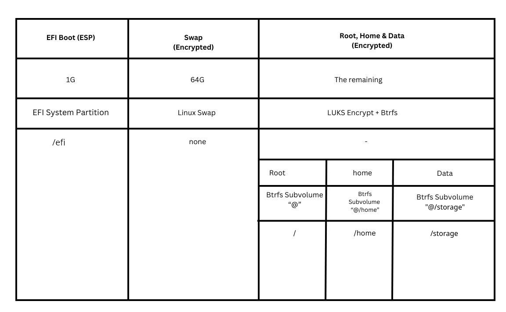

+++
title = "Arch Linux Installation with Fulll Disk Encryption + (Secure Boot, TPM2, UKI and more)"
date = 2025-08-21
[taxonomies]
tags = ["Linux"]
+++

## 1\. Verify ISO

- Verify the hash of the iso image file. We can use either the following two commands.

```sh
# Inside the directory of the downloaded iso
b2sum -c b2sums.txt --ignore-missing
```

or,

```sh
sha256sum -c sha256sums.txt --ignore-missing
```

- Verify the signature so that we make sure that we have downloaded the iso from the original author instead of a malicious actor.

```sh
# First download and import the pulic key in order to verify the signature
gpg --auto-key-locate clear,wkd -v --locate-external-key pierre@archlinux.org

# Then verify
gpg --verify archlinux-2024.01.01-x86_64.iso.sig
```
&ensp;

## 2\. Connect to the WiFi if not using Ethernet

We can use `nmtui` which is a terminal user interface. Also we can use `iwctl` with which we can connect to the WiFi using the following commands.

```sh
# Enter the iwctl command environment
iwctl

# List available wifi devices
device list

# Connect to the wifi
station wlan0 connect mywifiname
# It will prompt us to enter the passpharse. SO, enter the passphrase of the wifi.

exit
```
&ensp;

## 3\. Steps to connect with ssh

```sh
# Start the sshd daemon
sudo systemtcl start sshd

# Create a password so that we can login wiht ssh
passwd
```
&ensp;

## 4\. Check Networks

```sh
ping google.com
```
&ensp;

## 5\. Check EFI Boot Mode

The following should print out something if booted into UEFI Boot mode properly.

```sh
efivar -l
```

Or,

```sh
ls /sys/firmware/efi/efivars
```
&ensp;

## 6\. Set Clock correctly

```sh
timedatectl set-ntp true
```
&ensp;

## 7\. Disk Partitioning
- ***Note: As we will be using UKIs, the UKIs will be stored inside the esp. So, for multiple kernels 1G esp is not enough. If you want to use multiple kernels then make sure to use esp with at least 2G size.***
### Example partition table (For 1TB Drive)
- In total, 3 partitions.
- EFI Boot, Swap, The rest (Root, Home and Data)
- EFI Boot - 1G
- Swap - 64G
- Btrfs Partition - Around 888G Left
	- Root
	- Home
	- Data

Example Partition Table


&ensp;

### Check the correct disk

It should print out the disks and partitions they have. (i.e. "`/dev/sda`" in this example).

```sh
lsblk
```

### Partition with "cfdisk"

```sh
cfdisk
```

- Select label type "`gpt`"
- If required, Delete the existing partitions by selecting them and clicking "`Delete`"
- Create new 1 GiB Boot Partition with "`1G`". Set the Type to "`EFI Filesystem`" Set the `Bootable` Flag. Set `Primary`. Set the Label to "`boot`".
- Create new 64 GiB Swap Partition with "`64G`". Set the Type to "`Linux Swap`". Set `Primary`. Set the Label to "`swap`".
- Create new Partition with the rest of the space. Set the Type to "`Btrfs`". Set `Primary`. Set the Label to "`cryptpart`".
- Write the changes.
- Done.
&ensp;

## 8\. Prepare the partitions

### Format the Boot Partition

```sh
mkfs.fat -F 32 /dev/sda1
```

### Create encrypted swap partition
Use cryptsetup-luksFormat(8) to create the encrypted container for the swap partition:
```
# cryptsetup luksFormat --label swap /dev/sda2
```

Open the container to `/dev/mapper/swap`:
```
# cryptsetup open /dev/disk/by-label/swap swap
```

Create a swap filesystem inside the mapped partition:
```
# mkswap /dev/mapper/swap
```

If not using systemd#GPT partition automounting, add the mapped partition to `/etc/fstab` by adding the following line:
```
/dev/mapper/swap none swap defaults 0 0
```

To set up your system to resume from hibernation, use the `resume=/dev/mapper/swap` kernel parameter. See [Power management/Suspend and hibernate#Pass hibernate location to initramfs](https://wiki.archlinux.org/title/Power_management/Suspend_and_hibernate#Pass_hibernate_location_to_initramfs) for details. 

See TPM keys stuff below.

### Prepare Btrfs Partition

- Use `cryptsetup` to setup encryption on the partition.
```sh
cryptsetup luksFormat --label cryptpart -v -s 512 -h sha512 /dev/sda3
```

- Open the encrypted partition.
```sh
cryptsetup open /dev/sda3 cryptpart
```

- Format the mapped device to `btrfs`.
```sh
mkfs.btrfs -L btrfscrypt /dev/mapper/cryptpart
```

- Create `btrfs subvolumes`.
```sh
mount /dev/mapper/cryptpart /mnt
cd /mnt

btrfs sub create /mnt/@
btrfs sub create /mnt/@home

umount -R /mnt
```

See TPM keys stuff below.
&ensp;

## 9\. Mount the Partitions

```sh
mount -o rw,noatime,ssd,space_cache=v2,compress=zstd,discard=async,subvol=@ /dev/mapper/cryptpart /mnt
mount -o rw,noatime,ssd,space_cache=v2,compress=zstd,discard=async,subvol=@home /dev/mapper/cryptpart /mnt/home

mkdir /mnt/boot
mkdir /mnt/efi
mount /dev/sda1 /mnt/efi
```
&ensp;

## 10\. Install the base system

- Set the mirrors properly and change the pacman conf before installing the system for faster downloads.
```sh
cp /etc/pacman.d/mirrorlist /etc/pacman.d/mirrorlist.backup

pacman -S reflector

reflector --verbose --country BD,DE,HK,IN,SE,CH,SA,US --protocol https --sort rate --latest 20 --download-timeout 6 --save /etc/pacman.d/mirrorlist --score 8
```

- Also save the config inside the installation system.
```sh
cp /etc/pacman.d/mirrorlist /mnt/etc/pacman.d/mirrorlist
```

- Enable pacman goodies.
```sh
vim /etc/pacman.conf
--------------------
# Add the following lines.
Color
ParallelDownloads = 5
ILoveCandy

[multilib]
Include = /etc/pacman.d/mirrorlist
```

- Update the pacman database.
```sh
pacman -Sy
```

- Install the system
```sh
pacstrap -K /mnt base base-devel linux linux-firmware linux-headers linux-zen linux-zen-headers nvim dialog iw wpa_supplicant networkmanager cryptsetup amd-ucode sbctl
```

- ***Note: If using LVM, for LVM to work also install the `lvm2` package with pacstrap. This will make the `lvm2` hook for mkinitcpio.***
&ensp;

## 11\. Generate fstab config

```sh
genfstab -U /mnt >> /mnt/etc/fstab
```

To verify that we can type

```sh
cat /mnt/etc/fstab
```
&ensp;

## 12\. Configure the system in Chroot

```sh
arch-chroot /mnt
```

### Set Time-Zone

```sh
ln -sf /usr/share/zoneinfo/America/New_York /etc/localtime

hwclock --systohc
```

### Set Localization

```sh
echo en_US.UTF-8 UTF-8 >> /etc/locale.gen

locale-gen
```

### Set Language

```sh
echo LANG=en_US.UTF-8 > /etc/locale.conf
export LANG=en_US.UTF-8
```

### Set Hostname

```sh
echo arch > /etc/hostname
```

### Set Root Password

```sh
passwd
```

### Create New User

```sh
useradd -m -g users -G sys,wheel,adm,log,storage,power -s /bin/bash john

passwd john
```

### Set sudoers

```sh
visudo EDITOR=nvim
------------------
# Uncomment or add the following line.

% wheel ALL = (ALL) ALL
```

### Setup /etc/hosts

```sh
vim /etc/hosts
-----------------------
127.0.0.1 localhost
:: localhost
127.0.1.1 arch
```
&ensp;

## 13\. Generate initramfs
- We want to create Unified Kernel Images, so first, let's create our kernel cmdline file. This doesn't need to contain anything because we're using Discoverable Partitions, we just do it so `mkinitcpio` doesn't complain:
```sh
echo "quiet rw" > /etc/kernel/cmdline
```

- Let's create the EFI folder structure:
```sh
mkdir -p /efi/EFI/Linux
```

- We need to change the `HOOKS` in `mkinitcpio.conf` to use `systemd`, so make yours look like:
```sh
/etc/mkinitcpio.conf
--------------------------------------------------------------------------------------------------

# vim:set ft=sh
MODULES=()

BINARIES=()

FILES=()

HOOKS=(base systemd autodetect modconf kms keyboard sd-vconsole sd-encrypt block filesystems fsck)
```

- And now let's update the `.preset` file, to generate a UKI:
```sh
/etc/mkinitcpio.d/linux.preset
-----------------------------------------------------------------------

# mkinitcpio preset file to generate UKIs

ALL_config="/etc/mkinitcpio.conf"
ALL_kver="/boot/vmlinuz-linux"
ALL_microcode=(/boot/*-ucode.img)

PRESETS=('default' 'fallback')

#default_config="/etc/mkinitcpio.conf"
#default_image="/boot/initramfs-linux.img"
default_uki="/efi/EFI/Linux/arch-linux.efi"
default_options="--splash /usr/share/systemd/bootctl/splash-arch.bmp"

#fallback_config="/etc/mkinitcpio.conf"
#fallback_image="/boot/initramfs-linux-fallback.img"
fallback_uki="/efi/EFI/Linux/arch-linux-fallback.efi"
fallback_options="-S autodetect"
```

- And now let's generate our UKIs:
```sh
mkinitcpio -P
```
&ensp;

## 14\. Install the Bootloader
We are using systemd boot here.
```sh
bootctl install --esp-path=/efi
```
&ensp;

## 15\. Install packages

### Install some basic packages

```sh
pacman -S mesa xdg-user-dirs fuse2 ntfs-3g usbutils cpio git unzip alacritty openssh
```

### Nvidia propieretary stuff

```sh
sudo pacman -S nvidia-dkms opencl-nvidia lib32-opencl-nvidia libglvnd nvidia-utils lib32-libglvnd lib32-nvidia-utils nvidia-settings
```

## 16\. Enable Services

```sh
systemctl --enable --startnow NetworkManager
systemctl --enable --startnow wpa_supplicant.service
systemctl --enable fstrim.timer
```
&ensp;

## 17\. Secure Boot
OK, let's reboot, and then finish off the installation. Whilst you're rebooting, head into your UEFI/BIOS and put Secure Boot into "Setup Mode", you'll need to check with your PC/Motherboard manufacturer for exact details on how to do that. Basically disabling Secure Boot should put it to "Setup Mode".

```sh
$ sync
$ systemctl reboot --firmware-setup
```

Ok, now that we've rebooted and logged back in (we're not in chroot anymore we're inside the actual system), we need to first check that Secure Boot is in "Setup Mode":

```sh
# If sbctl is not installed
sudo pacman -Sy sbctl

# Optionally remove any leftover *.img files
sudo rm -rf /boot/initramfs-*.img
```

```sh
$ sbctl status
Installed:  ✓ sbctl is installed
Setup Mode: ✗ Enabled
Secure Boot:    ✗ Disabled
Vendor Keys:    none
```

Looks good. Let's first create and enroll our personal Secure Boot keys:

```sh
$ sudo sbctl create-keys
$ sudo sbctl enroll-keys -m
```

We use the `-m` option to enroll the Microsoft vendor key as well as our self-created platform key. IF you're sure that none of your hardware has any `OPROMs` signed by Microsoft, you can leave this option out. **WARNING - Your system CAN get bricked if you're mistaken. I know it sucks, but it's usually safer to just install the Microsoft vendor key. YOU HAVE BEEN WARNED!!! :-)**

Let's use `sbctl` to sign our `.efi` files. We'll sign the `systemd-boot .efi` file, and our UKI files which `mkinitcpio` is now generating for us. We'll use the `-s` option so `sbctl` will automatically resign them for us when we update the kernel or bootloader through `pacman`:

```sh
$ sudo sbctl sign -s -o /usr/lib/systemd/boot/efi/systemd-bootx64.efi.signed /usr/lib/systemd/boot/efi/systemd-bootx64.efi
$ sudo sbctl sign -s /efi/EFI/BOOT/BOOTX64.EFI
$ sudo sbctl sign -s /efi/EFI/Linux/arch-linux.efi
$ sudo sbctl sign -s /efi/EFI/Linux/arch-linux-fallback.efi
```

- Quick Note: If we want to disenroll an efi binary from `sbctl` for signing, we can simply use the following command:
```sh
sudo sbctl rm "/efi/EFI/Linux/arch-linux.efi"
sudo sbctl rm "/efi/EFI/Linux/arch-linux-fallback.efi"
```
This will basically remove the efi binary from the `sbctl` database which will simply cause `sbctl` not looking for the efi binary for auto signing.

Let's reinstall the kernel to make sure it resigns the UKI:

```sh
$ sudo pacman -S linux
... (I've cut out the blurb)** ...
(4/4) Signing EFI binaries...
Generating EFI bundles....
✓ Signed /efi/EFI/Linux/arch-linux-fallback.efi
✓ Signed /efi/EFI/Linux/arch-linux.efi
```

Looking good. Reboot your PC now, so the Secure Boot settings will get saved. 
&ensp;

## 18\. TPM2 Unlocking
### Unlocking the Root filesystem with TPM2

Once rebooted we need to configure automatic unlocking of the root filesystem, by binding a LUKS key to the TPM. Let's generate a new key, add it to our volume so it can be used to unlock it in addition to the existing keys, and bind this new key to `PCRs 0 and 7` (the system firmware and Secure Boot state). First things first, let's generate a recovery key in case it all gets messed up some time in the future:
```sh
$ sudo systemd-cryptenroll /dev/gpt-auto-root-luks --recovery-key
```

**Keep this key safe. Keep it hidden**. Moving on, we'll now enroll our system firmware and Secure Boot state. Normally, this would allow our TPM to unlock our encrypted drive, as long as the state hasn't changed. If you're particularly paranoid, you can add `--tpm2-with-pin=yes`, so we get prompted for a PIN code on boot.

- In terms of using PCRs the default recomendation is `0+7`:
```sh
$ sudo systemd-cryptenroll --tpm2-device=auto --tpm2-pcrs=0+7  /dev/gpt-auto-root-luks
```

- But I like to do PCRs `0+1+2+7+11+13+15`:
```sh
$ sudo systemd-cryptenroll --tpm2-device=auto --tpm2-pcrs=0+1+2+7+11+13+15  /dev/gpt-auto-root-luks
```

See about [TPM PCRs](https://wiki.archlinux.org/title/Trusted_Platform_Module#Accessing_PCR_registers) to learn more about them.
&ensp;

### Unlocking the Swap filesystem with TPM2

The following provides unattended swap decryption with a key stored in the TPM.

You can use systemd-cryptenroll to enroll the key to the Luks container and TPM, and wipe the previously created keyslot containing the password:

```sh
#Syntax
$ sudo systemd-cryptenroll --tpm2-device auto /dev/device
$ sudo systemd-cryptenroll --wipe-slot password /dev/device

# Example
$ sudo systemd-cryptenroll --tpm2-device auto --tpm2-pcrs=0+1+2+7+11+13 /dev/sda2
$ sudo systemd-cryptenroll --wipe-slot password /dev/sda2
```

Check the result with

```sh
$ systemd-cryptenroll /dev/device
SLOT TYPE
   0 tpm2
```
&ensp;

## 19\. Reboot
Now we need to reboot and test this. If all goes well, we should be able to unlock our encrypted root partition with just a PIN code.
```sh
reboot
```
&ensp;

## 20\. Install the DE

```sh
pacman -S sddm plasma

systemctl --enable --startnow sddm.service
```
&ensp;

## 21\. Important packages and tweaks (Post Install)
- Some packages
```sh
sudo pacman -S gparted nload btop pipewire refelctor devtools xdg-desktop-portal xdg-desktop-portal-kde xdg-user-dirs mpv proton-vpn-gtk-app ufw zsh zsh-autocomplete zsh-completions zsh-syntax-highlighting libreoffice-fresh dnsmasq qemu-desktop virt-manager timeshift cronie dolphin okular gvfs man-db tmux yt-dlp python-mutagen kwallet kwalletmanager gimp
```

- Fonts
```sh
sudo pacman -S ttf-jetbrains-mono-nerd ttf-jetbrains-mono
```

- Printing
```sh
sudo pacman -S cups system-config-printer skanlite skanpage hplip
```

- Thumbnails
```sh
sudo pacman -S ffmpegthumbs tumbler

# If something doesn't work, we can try this
sudo pacman -S ffmpegthumbnailer
```

- AUR packages
	- Install AUR helper
```sh
git clone https://aur.archlinux.org/pikaur.git
cd pikaur
makepkg -si
```
- Install AUR packages	
```sh
pikaur -S auto-cpufreq brave-bin vscodium-bin peazip sublime-text-4

sudo systemctl enable auto-cpufreq --now
```

- Codecs and Multimedia
```sh
# First try this
sudo pacman -S vlc vlc-plugin-ffmpeg vlc-plugin-mpeg2 vlc-plugin-x264 vlc-plugin-x265 vlc-plugin-ass vlc-plugin-matroska vlc-plugin-dvd vlc-plugin-bluray vlc-plugin-srt vlc-plugin-soxr libdvdcss libbluray

# If see errors, then try this
sudo pacman -S gst-libav gst-plugins-base gst-plugins-good gst-plugin-pipewire

# If still see errors, then try this
sudo pacman -S libx264 libmpeg2 xvidcore

# If you still see errors, then try this
sudo pacman -S codec2 flac ffnvcodec-headers lib32-flac lib32-libjpeg-turbo lib32-opus lib32-libvpx lib32-speex libde265 libfdkaac libjpeg-turbo libkate libultrahdr libvpx opus sbc speex xvidcore
```

- Flatpaks
```sh
flatpak install pikabackup
```

- Install OhMyZsh
```sh
sh -c "$(curl -fsSL https://raw.githubusercontent.com/ohmyzsh/ohmyzsh/master/tools/install.sh)"
```

- Fix Plasma not respecting `/etc/locale.conf`
```sh
mv ~/.config/plasma-localerc ~/.config/plasma-localerc.backup
```

- Enable services
```sh
sudo systemctl enable --now libvirtd cups
```

- For NVIDIA stuff see: [Get Nvidia working](#)

Done!
